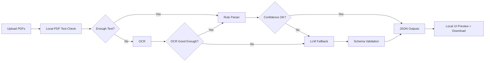
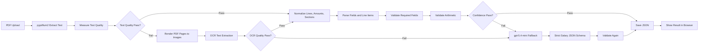

# Salary Slip Extraction Workflow

The main path should stay deterministic and local. Use `pypdfium2` first, then
only escalate to OCR or LLM fallback when confidence checks fail.

## High-Level Flow



## Detail Flow



## Threshold Summary

| Checkpoint | Pass Threshold | Fail / Escalate When | Next Step |
| --- | --- | --- | --- |
| PDF text layer | `>= 300` total chars, `>= 150` chars/page, `>= 8` non-empty lines | `< 150` total chars, `< 80` chars/page, or `< 5` non-empty lines | OCR |
| Money detection | At least `3` money-like amounts | `0` money-like amounts | OCR, then LLM if OCR also fails |
| Payroll keyword detection | At least `1` payroll keyword | No payroll keyword found | OCR, then LLM if OCR also fails |
| Readable character ratio | At least `60%` readable characters | Less than `60%` readable characters | OCR |
| OCR result | `>= 300` chars, `>= 3` money amounts, `>= 1` payroll keyword | Below any OCR pass threshold | LLM fallback |
| Required fields | All required fields found | Missing worker, institution, paid salary, gross income, or deduction total | LLM fallback |
| Arithmetic validation | `paid = gross - deduction` within tolerance | Difference exceeds tolerance | LLM fallback or manual review |
| Line item classification | At least `70%` of line items classified | More than `30%` unclassified | LLM fallback |
| Net pay sanity | `0 <= paid_salary_total <= gross_income_total` | Net pay is negative or greater than gross | LLM fallback or manual review |

## Current Implementation

- `pypdfium2` extracts raw text and per-page lines.
- When the text layer is below threshold, the app renders pages with
  `pypdfium2` and runs local Apple Vision OCR on macOS.
- The analyzer now handles common real-life salary-slip layouts:
  - One amount at the end of a row.
  - Two-column rows such as `earning amount deduction amount`.
  - Labels listed separately from amount lines.
  - Parenthesized deductions.
  - Net pay shown on the same line, next lines, or nearby previous lines.
- Output remains two JSON layers:
  - `all_extracted.json` for raw extraction.
  - `salary_summary.json` for payroll interpretation and grand totals.

## Recommended Fallback Strategy

1. Keep deterministic `pypdfium2` extraction as the default because it is local,
   fast, free per document, and easy to audit.
2. Use local OCR for scanned PDFs. `pypdfium2` renders pages; Apple Vision OCR
   processes those rendered images on macOS.
3. Add an optional LLM/VLM fallback only for low-confidence PDFs: missing text
   layer, failed arithmetic checks, or missing required fields.

## Confidence Thresholds

Use these as practical starting thresholds. They are intentionally conservative
so normal salary slips stay local and only difficult PDFs escalate.

### Text Quality Pass

Treat `pypdfium2` text as good enough when all are true:

- Total extracted characters across the PDF: at least `300`.
- Average extracted characters per page: at least `150`.
- Extracted non-empty lines across the PDF: at least `8`.
- At least `3` money-like amounts are found.
- At least `1` payroll keyword is found, such as `gaji`, `salary`, `upah`,
  `pendapatan`, `earnings`, `potongan`, `deduction`, `net`, or `take home`.

Treat it as not enough text when any are true:

- Total extracted characters: less than `150`.
- Average extracted characters per page: less than `80`.
- Non-empty lines: fewer than `5`.
- No money-like amount is found.
- Text is present but mostly broken symbols, meaning fewer than `60%` of
  characters are letters, digits, punctuation, or spaces.

### OCR Quality Pass

After OCR, continue to the rule parser when:

- Total OCR characters: at least `300`.
- At least `3` money-like amounts are found.
- At least `1` payroll keyword is found.
- OCR text is not dominated by repeated garbage characters.

If OCR fails those checks, use the LLM fallback.

### Parser Confidence Pass

Accept the rule parser result when all required fields are present:

- `worker_name`
- `institution`
- `paid_salary_total`
- `gross_income_total`
- `deduction_total`

Then validate:

```text
abs(paid_salary_total - (gross_income_total - deduction_total)) <= tolerance
```

Recommended tolerance:

- `0` for integer payroll slips.
- Up to `1,000` IDR for rounded slips.
- Up to `0.5%` of gross income if the slip explicitly says rounded.

Escalate to LLM fallback when:

- Any required field is missing.
- Arithmetic validation fails.
- More than `30%` of line items are unclassified.
- Net pay is found, but it is lower than `0` or higher than gross income.

## LLM Fallback Model

Recommended default: `gpt-5.4-mini`.

Why:

- It supports text and image inputs, so it can handle PDF pages or rendered
  page images.
- It supports Structured Outputs, so the response can be forced into the same
  salary summary JSON schema.
- It is a mini model, making it a better fit for cost-sensitive fallback work
  than a flagship model.

Cost-first alternative: `gpt-5-mini`.

Use the LLM only after local parsing fails confidence checks. The LLM result
should still be validated with the same arithmetic rule:

```text
paid_salary_total = gross_income_total - deduction_total
```
